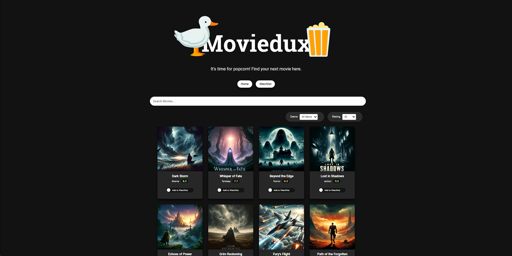
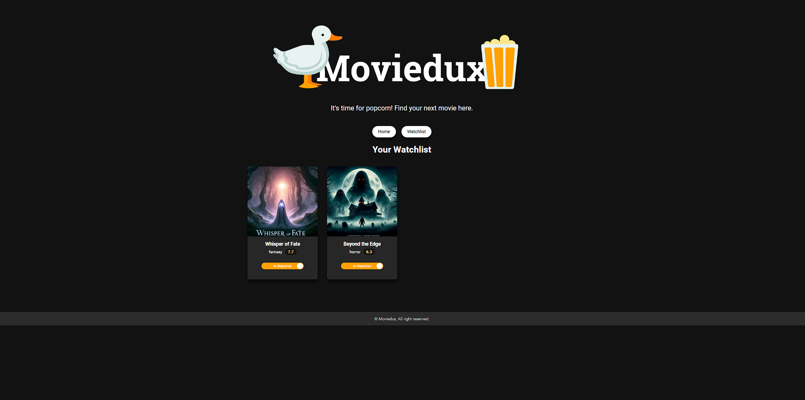

# 🎬 Movie Dux

Here’s an updated and enhanced version of your feature list for your React movie app project, incorporating:

📂 Movie Categories by Genre

⭐ Watchlist Functionality

🔀 React Router for Navigation

# 🖥️ Preview

### Home Page



### Categories By Genre


### Resonsive Design


### Watchlist



# 🚀 Features

📖 Browse Movies

- View a list of movies with title, genre, and rating
- Filter movies by genre/category

🖼️ Movie Card Layout

- Displays poster image, title, genre, and rating

- Dynamic UI with fallback image/error handler

⚛️ React Hooks

- useState, useEffect, useReducer for managing state

- useContext to manage watchlist state globally

💾 Watchlist Feature

- Add or remove movies to/from your personal watchlist

- Watchlist persists during the session

🔀 Routing with React Router

- Navigate between Home, Watchlist, Movie Details

- Dynamic routes (e.g. /movie/:id) to view movie-specific info

🎨 Clean and Responsive UI

- Minimalist design, styled components or custom CSS

- Fully responsive across screen sizes

## 📦 Installation

Clone the repository and install dependencies:

```bash
git clone https://github.com/yourusername/movie-dux.git
cd movie-dux
npm install
npm start
```

# 🤝 Open for Contributions

- Found a bug or want to improve this project?
- Feel free to open an issue or submit a pull request! 🙌
